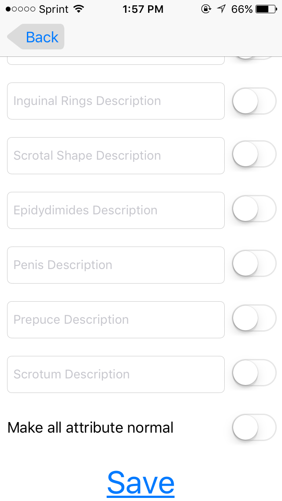

# Bull Soundness Evaluation (BSE-A4VM)

## Contents

*  [General Information](#GenInfo)
*  [Initial Setup](#Setup)
*  [Home Screen](#HomeScreen)
  *  [Clean Up](#Cleanup)
*  [Groups](#Groups)
  *  [View Dashboard](#Dashboard)
  *  [Create New Group](#NewGrp)
  *  [Edit a Group](#EditGrp)
*  [Bulls](#Bulls)
  *  [Bull Dashboard](#BullBoard)
  *  [Bull Exams](#Exams)
  *  [Bull Information](#BullInfo)
  *  [Sex & Mating Information](#SexInfo)
  *  [Physical Parameters](#Parameters)
  *  [Morphology Information](#Morph)
  *  [Motility Information](#Motility)
  *  [Classification Information](#Classify)
*  [Export](#Export)
*  [Data Clean up](#CleanUp)

<h1 id="GenInfo">General Information</h1>
BSE-A4VM app aids users to collect data while evaluating bulls. It allows for the collection of nearly 100+ fields about bulls and the mass export of data in CSV format that can then be used in MS Excel or other data processing applications.
<h3>Download the app from:</h3>
* [for iPhone](https://play.google.com/store?hl=en) *TODO: Add link to app page on iStore*
* [for Android](https://play.google.com/store?hl=en) *TODO: Add link to app page on Google Play Store*

_For most part, these mobile applications do not require network access._  They will require access to the email client on the phone when the user decides to email the collected data.

Since the mobile app has consistent look and feel on both Android and iPhone platforms, the rest of this documentation will describe the app with no specific reference to the platform.  When screenshots are provided for illustration, screenshots from both iPhone app (left) and Android app (right) will be provided.

<h1 id="Setup">Initial Setup</h1>
Upon opening the application for the first time after installation, veterinarian will be prompted to input personal information such as name and email address.

Current veterinary information can be viewed and edited via the _Settings_ page of the application.

<table>
 <tr>
  <td></td>
  <td></td>
 </tr>
</table>

Before proceeding to collecting data, morphology fields will also have to be configured. This information will allow you to use the in-application counter to assist in collecting count data about bull semen samples.  By default, the first field is labelled as "Normal" and the users cannot reconfigure this field.

<table>
 <tr>
  <td></td>
  <td></td>
 </tr>
</table>

<h1 id="HomeScreen">Home Screen</h1>
*TODO: Add content here*

*TODO: Add screenshot of home screen*

<h3 id="Cleanup">Clean Up</h3>
The application saves the collected data on the phone until you delete it.  So, to delete all data collected prior to 30 days, click on _Delete 30+ day old data_.  Please note such a clean up will be permanent and cannot be undone.  You can also perform such a clean up at group level. It is recommended that you periodically delete data to prevent the app from eating the storage space on your phone.

<h1 id="Groups">Groups</h1>
A _group_ is a group of bulls along with their examination data.  Each ranch/location/owner can have multiple groups, e.g., one group for each day of the visit to the ranch, one group for the morning batch of bulls and one group for the afternoon batch of bulls.

<h3 id="Dashboard">View Dashboard</h3>
From the home screen, you can get to the _Dashboard_ by clicking on the _Groups_ button.  The dashboard allows you to view the list of groups on the phone and create new groups. *TODO: Use realistic names for ranch and ower, e.g., Dodge City Ranch.*

<table>
 <tr>
  <td></td>
  <td></td>
 </tr>
</table>

<h3 id="NewGrp">Create New Group</h3>
If you chose to create a new group by clicking _Add New Group_, then you will be prompted to input data about the owner of the set of bulls to be examined in this group.  Once you click _Save_, the data will be saved and you will be able to collect data about bulls.

<table>
 <tr>
  <td></td>
  <td></td>
 </tr>
</table>

<h3 id="EditGrp">Edit a Group</h3>
This screen allows you to view and edit data for bulls in the current group (by clicking _View/Edit Bulls_). It also allows you to export the data for the current group of bulls (by clicking _Export Data_).  

<table>
 <tr>
  <td></td>
  <td></td>
 </tr>
</table>

<h1 id="Bulls"> Bulls </h1>

<h3 id="BullBoard">Bull Dashboard</h3>
This screen allows you to view and edit data about bulls.  The data about a specific bull can be viewed and edited by clicking on the corresponding _Bull ID_ button.  A new entry for a bull can be added to the group by clicking on _Add New Bull_ button.

<table>
 <tr>
  <td></td>
  <td></td>
 </tr>
</table>

<h3 id="Exams">Bull Exams</h3>
This screen allows you to enter various data about the bull being examined (or edit previously collected data).  Data about bulls are grouped into sets of related data, e.g., bull info, morphology, motility.  Each group can be accessed by clicking the corresponding button.

To assist the examiner make a thorough examination, the app uses a simple color scheme.  
  - If the examiner visits a data group and fills out some (not all) data fields, then the button or the marble for the group changes to blue color.
  - If the examiner filled all data fields of a data group, then the button or the marble for the group changes to green color.

<table>
 <tr>
  <td></td>
  <td></td>
 </tr>
</table>

<h3 id="BullInfo">Bull Information</h3>
You can come to this screen from the Bull Exams screen. Each field will have a hint associated with it to suggest the type of information this field accepts. A field is highlighted in red if you enter invalid data. Also, at least one ID field among Tag, Tattoo, RFID and Brand has to be filled. The Bull's age is also mandatory and will be automatically filled if the date of birth has been filled. Remember to click on the save button after you have entered the necessary information. See screenshots below for an illustration. The first two screen shots from the left are for iPhone and the last one is for Android.

<table>
 <tr>
  <td></td>
  <td></td>
  <td></td>
 </tr>
</table>

<h3 id="SexInfo">Sex & Mating Information</h3>
You can come to this screen from the Bull Exams screen. Each field will have a hint associated with it to suggest the type of information this field accepts. Click on the save button before you navigate from the screen. If you try to enter invalid information the app will warn you by highlighting the field in red.

<table>
 <tr>
  <td></td>
  <td></td>
 </tr>
</table>

<h3 id="Parameters">Physical Parameters</h3>
You can come to this screen from the Bull Exams screen. This screen will have two buttons. One will take the user to the Measurements screen and the other will take the user to the Physical Exam screen. On both of those screens enter data in the fields as suggested by the hints. Invalid data in any of the fields will result in the field being highlighted as red. beside each field there will be a check box to inditcate "normal" or not. Checking the check box will indicate "normal", not checking it will indicate "not normal". At the bottom of the screen before the save button there will be another check box labelled "Select all as Normal". Checking this will check all the check boxes and unchecking it will uncheck all the check boxes. Remember to hit save before navigating away from the app. See screens shots below for an illustration.

<table>
 <tr>
  <td></td>
  <td></td>
 </tr>
 <tr>
  <td></td>
  <td></td>
 </tr>
 <tr>
  <td></td>
  <td></td>
 </tr>
</table>

<h3 id="Morph">Morphology Information</h3>
Morphology information is captured in a screen called "Morphology Dashboard". You can come to this screen by clicking on the "morphology" button in the "Bull Exams" screen. This screen will have:

1. A button at the top called "Add New Semen Collection"
2. A list of "Semen collection counts" captured on a particular date.

Clicking on the button will take you to a page with a list of buttons. These buttons represent the Morphology information you had setup in the "Settings" section of the app. This page can have a maximum of eight buttons. Clicking on each button will increase that particular Morphology by 1. When you change from one button to another an alarm will be set off to warn you of that change. When you reach the limit/threshold for that morphology, another alarm will be set off to warn you.

You will be able to see the total morphology count on the "Morphology Dashboard" screen. Clicking on each Semen collection in the dashboard will give you the break up of the counts in each morphology. See screenshots below for an illustration.

<table>
 <tr>
  <td></td>
  <td></td>
 </tr>
 <tr>
  <td></td>
  <td></td>
 </tr>
</table>

<h3 id="Motility">Motilility Information</h3>
You can come here from the "Bull Exams" screen. Fill in all the details as provided by the hints in each field. Invalid values will result in a warning. Hit Save before you leave the screen. See screenshots below.

<table>
 <tr>
  <td></td>
  <td></td>
 </tr>
</table>

<h3 id="Classify">Classification Information</h3>
You can come here from the "Bull Exams" screen. Fill in all the details as provided by the hints in each field. Invalid values will result in a warning. Hit Save before you leave the screen. See screenshots below.

<table>
 <tr>
  <td></td>
  <td></td>
 </tr>
</table>

<h3 id="Comments">Comments & Other Information</h3>
You can come here from the "Bull Exams" screen. Fill in all the details as provided by the hints in each field. Invalid values will result in a warning. Hit Save before you leave the screen. See screenshots below.

<table>
 <tr>
  <td></td>
 </tr>
</table>

<h1 id="Export">Export Group</h1>
At any time you can click on "Export Data" in the "Group" to screen to export the entire collection to a file in CSV format and email it.

